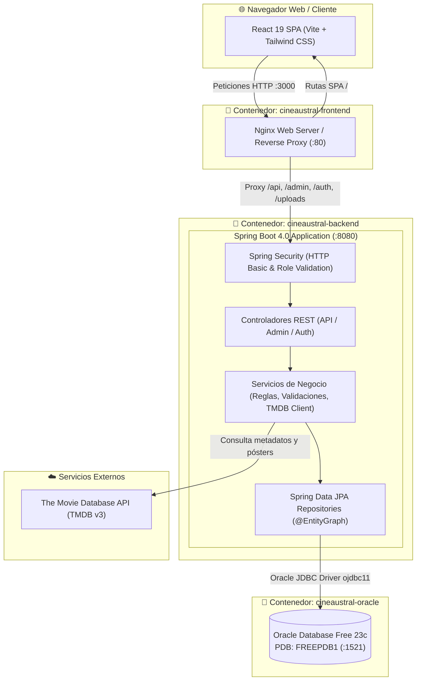

# 🎬 CineAustral — Sistema Integral de Gestión Cinematográfica y Reservas en Tiempo Real

<p align="center">
  
  
  
  
  
  
  
</p>

---

## 📖 Descripción General

**CineAustral** es una plataforma web full-stack de alto rendimiento diseñada para la administración integral y venta de entradas de un complejo de cine comercial de múltiples salas. Combina una experiencia de usuario interactiva y fluida con una arquitectura de backend empresarial robusta, desacoplada y orientada al cumplimiento estricto de reglas de negocio en tiempo real.

El proyecto modela el ecosistema completo de un complejo cinematográfico patagónico de dos salas físicas (**Sala Lobo Marino** y **Sala Pingüino Magallanes**), permitiendo a los clientes explorar la cartelera, consultar funciones y reservar butacas en un plano interactivo. A su vez, provee un **Panel de Control Administrativo** con analíticas en tiempo real, integración automática con la API oficial de **The Movie Database (TMDB)**, programación de funciones sin solapamiento y mantenimiento de butacas.

> 🎓 **Contexto Académico:** Proyecto desarrollado para la cátedra de *Ingeniería de Software* — Licenciatura en Informática (UNPSJB).  
> 👤 **Autor:** Ignacio Nicolás Montiel Ruiz.

---

## 📑 Tabla de Contenidos

1. [⚡ Despliegue con Docker (Linux y Windows)](#-despliegue-con-docker)
   - [Requisitos Previos](#requisitos-previos)
   - [Paso 1: Obtención del Código (Git o Descarga .ZIP)](#paso-1-obtención-del-código-git-o-descarga-zip)
   - [Paso 2 (Linux / macOS): Despliegue con Docker](#-paso-2-linux--macos-despliegue-con-docker)
   - [Paso 2 (Windows): Despliegue con Docker](#-paso-2-windows-despliegue-con-docker)
   - [Comandos Útiles de Control](#-comandos-útiles-de-control)
   - [Tiempo de Espera en el Primer Arranque (Oracle 23c)](#-tiempo-de-espera-en-el-primer-arranque)
2. [🔑 Accesos y Cuentas de Demostración](#-accesos-y-cuentas-de-demostración)
3. [🏛️ Arquitectura del Sistema](#️-arquitectura-del-sistema)
4. [🧭 Recorrido por Módulos y Funcionalidades](#-recorrido-por-módulos-y-funcionalidades)
5. [💡 Decisiones de Ingeniería y Buenas Prácticas](#-decisiones-de-ingeniería-y-buenas-prácticas)
6. [💻 Ejecución Local sin Docker (Modo Desarrollo)](#-ejecución-local-sin-docker-modo-desarrollo)
7. [🔧 Resolución de Problemas (Troubleshooting)](#-resolución-de-problemas-troubleshooting)
8. [📂 Estructura del Repositorio](#-estructura-del-repositorio)
9. [📬 Contacto](#-contacto)

---

## ⚡ Despliegue con Docker

El sistema está completamente contenedorizado con **Docker Compose**, lo que permite levantar todo el entorno (Base de datos **Oracle 23c**, API **Spring Boot** y Frontend **React + Nginx**) mediante la línea de comandos en cualquier sistema operativo sin necesidad de instalar Java, Maven o Node localmente.

### Requisitos Previos

- **Docker y Docker Compose v2** instalados:
  - En **Linux:** Docker Engine + Docker Compose Plugin (`docker compose version`).
  - En **Windows / macOS:** Docker Desktop en ejecución (ícono de la ballena verde activo).
- Puertos disponibles en la máquina anfitriona: `3000` (Frontend), `8080` (Backend API) y `1521` (Oracle DB).

---

### Paso 1: Obtención del Código (Git o Descarga .ZIP)

Puede obtener el proyecto mediante cualquiera de las siguientes dos opciones:

#### 🔹 Opción A: Clonar con Git (Recomendado)
Abra su terminal y clone el repositorio:
```bash
git clone https://github.com/MontielNico/CineAustral.git
cd CineAustral
```

#### 🔹 Opción B: Descargar como Archivo .ZIP (Sin Git)
1. En la parte superior de esta página de GitHub, haga clic en el botón verde **`< > Code`**.
2. Seleccione la opción **`Download ZIP`** y guarde el archivo comprimido en su computadora.
3. Descomprima el archivo `.zip`.
4. Abra una terminal situada dentro de la carpeta descomprimida (`CineAustral` o `CineAustral-Main`):
   - **En Windows:** Presione `Shift + Clic derecho` en un espacio en blanco dentro de la carpeta y elija *"Abrir en Terminal"* (o *"Abrir ventana de PowerShell aquí"*).
   - **En Linux / macOS:** Haga clic derecho dentro de la carpeta y seleccione *"Abrir en una terminal"* (o use el comando `cd /ruta/a/CineAustral`).

---

### 🐧 Paso 2 (Linux / macOS): Despliegue con Docker

Una vez ubicado en la carpeta del proyecto desde su terminal (Bash / Zsh), ejecute:

```bash
# 1. Compilar imágenes y levantar contenedores en segundo plano
docker compose up -d --build

# 2. Verificar que los servicios estén activos
docker compose ps
```

Abra su navegador web en:  
👉 **[http://localhost:3000](http://localhost:3000)**

Para detener la aplicación al finalizar:
```bash
docker compose down
```

> [!TIP]
> En distribuciones Linux, si no tiene configurado Docker para ejecutarse sin privilegios de superusuario, anteponga `sudo` a los comandos de `docker compose` o agregue su usuario al grupo: `sudo usermod -aG docker $USER`.

---

### 🪟 Paso 2 (Windows): Despliegue con Docker

Una vez ubicado en la carpeta del proyecto desde su terminal (**PowerShell** o **Símbolo del sistema / CMD**), ejecute:

```powershell
# 1. Compilar imágenes y levantar contenedores en segundo plano
docker compose up -d --build

# 2. Comprobar el estado de los contenedores
docker compose ps
```

Abra su navegador web en:  
👉 **[http://localhost:3000](http://localhost:3000)**

Para detener los servicios al terminar la evaluación:
```powershell
docker compose down
```

---

### 📋 Comandos Útiles de Control

Tanto en Linux como en Windows, puede gestionar el ciclo de vida del sistema con los siguientes comandos estándar:

| Acción | Comando |
|---|---|
| **Ver logs en vivo del backend** | `docker compose logs -f backend` |
| **Ver logs de la base de datos** | `docker compose logs -f oracle-db` |
| **Consultar estado y salud de los contenedores** | `docker compose ps` |
| **Detener todos los servicios preservando datos** | `docker compose down` |
| **Reiniciar la base de datos limpia desde cero** | `docker compose down -v && docker compose up -d --build` |

---

### ⏳ Tiempo de Espera en el Primer Arranque

La primera vez que se inicia el contenedor de **Oracle Database Free 23c**, el motor requiere aproximadamente **30 a 45 segundos** para inicializar el Pluggable Database (`FREEPDB1`) y preparar el esquema de datos.

* **Sincronización Inteligente:** El contenedor del backend Spring Boot (`cineaustral-backend`) implementa una política `depends_on` con comprobación de salud (`condition: service_healthy`), por lo que **esperará de forma autónoma** a que Oracle alcance el estado saludable antes de arrancar.
* Al ejecutar `docker compose ps`, observará el estado de los tres servicios:
  ```text
  NAME                  IMAGE                       STATUS                   PORTS
  cineaustral-oracle    gvenzl/oracle-free:latest   Up (healthy)             0.0.0.0:1521->1521/tcp
  cineaustral-backend   cineaustral-backend         Up                       0.0.0.0:8080->8080/tcp
  cineaustral-frontend  cineaustral-frontend        Up                       0.0.0.0:3000->80/tcp
  ```

---

## 🔑 Accesos y Cuentas de Demostración

El sistema incluye un componente **`DataSeeder`** automático que puebla la base de datos en su primer encendido con las salas físicas, 100 butacas organizadas por columnas por sala, películas con pósters de cartelera, funciones activas programadas y usuarios de demostración listos para evaluar:

| Rol | Correo Electrónico | Contraseña | Alcance y Flujos a Evaluar |
|---|---|---|---|
| 👑 **Administrador** | `admin@cineaustral.com` | `admin123` | Acceso completo al Panel de Administración (`/admin`): métricas operativas y gráficos, gestión de películas con buscador TMDB, programación de funciones sin solapamiento, inhabilitación de salas/asientos y auditoría de reservas. |
| 🎟️ **Cliente** | `cliente@cineaustral.com` | `cliente123` | Exploración de cartelera, selección interactiva de butacas en tiempo real, confirmación de compra y visualización/cancelación de reservas en "Mis Reservas". |

### Enlaces de Servicio
- **🌐 Aplicación Web (Frontend SPA):** [http://localhost:3000](http://localhost:3000)
- **⚙️ API REST (Backend Spring Boot):** [http://localhost:8080](http://localhost:8080)
- **🩺 Endpoint de Salud (Healthcheck):** [http://localhost:8080/ping](http://localhost:8080/ping)
- **🗄️ Listener de Base de Datos Oracle:** `localhost:1521`  
  *(Servicio / PDB: `FREEPDB1`, Usuario: `cineaustral`, Contraseña: `1234`)*

---

## 🏛️ Arquitectura del Sistema

El proyecto implementa una arquitectura desacoplada moderna en capas con separación estricta de responsabilidades:



---

## 🧭 Recorrido por Módulos y Funcionalidades

### 1. Portal de Clientes y Experiencia de Compra
- **Cartelera Dinámica:** Exploración de estrenos con pósters en alta definición, sinopsis, géneros, duración, calificación por edad (`ATP`, `+13`, `+18`) y puntuación.
- **Selector de Funciones:** Navegación por fechas y horarios, mostrando la sala asignada y la tarifa por entrada.
- **Mapa de Butacas Interactivo:**  
  Representación visual realista del auditorio (filas `A` a `F`, columnas izquierda, centro y derecha).
  - 🟢 **Disponible:** Butaca libre para selección.
  - 🔴 **Ocupada:** Asiento reservado previamente por otro cliente.
  - 🟡 **En Mantenimiento:** Butaca inhabilitada por administración.
- **Flujo de Autenticación Contextual:** Si un visitante anónimo selecciona butacas y hace clic en reservar, el sistema almacena temporalmente la intención de compra, redirige al inicio de sesión y reanuda el checkout una vez autenticado sin perder la selección previa.
- **Gestión de Reservas ("Mis Reservas"):** Historial de compras con código único de reserva, butacas asignadas y política de cancelación anticipada (habilitada hasta 10 minutos antes del inicio de la función).

### 2. Panel de Control de Administración (`/admin`)
- **Dashboard Operativo:** Visualización de métricas clave del negocio:
  - Total recaudado ($) y cantidad total de entradas emitidas.
  - Porcentaje de ocupación promedio por sala.
  - Gráfico interactivo de tendencia de ventas (últimos 7 días).
  - Feed de auditoría en vivo con las últimas transacciones registradas.
- **Gestión Integral de Películas & Integración TMDB:**
  - Alta, edición y eliminación de películas.
  - **Buscador directo conectado a la API de TMDB**: permite buscar cualquier título cinematográfico mundial e importar automáticamente título, duración, género, sinopsis y póster oficial.
  - Posibilidad de subir archivos locales de pósters con almacenamiento multipart en `/uploads`.
- **Programación Inteligente de Funciones:**
  - Creación de funciones con **detección de solapamiento de horarios**: el sistema valida matemáticamente que la nueva función no interfiera con otra función en la misma sala física, considerando la duración de la película más el tiempo de limpieza.
  - Control de ciclo de vida (`ACTIVA`, `FINALIZADA`, `CANCELADA`) con cancelación en cascada de reservas asociadas.
- **Control de Salas y Butacas:**
  - Inhabilitación general de una sala física (por refacciones o eventos privados).
  - Puesta fuera de servicio de butacas individuales que requieran mantenimiento técnico.
- **Auditoría de Reservas y Gestión de Usuarios:**
  - Visualización tabular de todas las reservas del complejo con filtros por estado.
  - Control de usuarios registrados y alternancia de privilegios de rol (`CLIENTE` / `ADMIN`).

---

## 💡 Decisiones de Ingeniería y Buenas Prácticas

### 1. Persistencia y Optimización de Consultas (JPA / Hibernate)
- **Persistencia en Oracle Database:** Integración con Oracle 23c mediante el driver oficial `com.oracle.database.jdbc:ojdbc11`.
- **Prevención del problema N+1:** Implementación de `@EntityGraph(attributePaths = {...})` en repositorios Spring Data para realizar fetch joins dirigidos en relaciones recurrentes (como *Sala -> Asientos* o *Función -> Reservas*), optimizando el tiempo de respuesta y evitando ejecuciones masivas de consultas SQL.
- **Desactivación de Open-Session-In-View:** Se fijó `spring.jpa.open-in-view=false` en `application.properties` para garantizar que las transacciones y las sesiones de persistencia se cierren estrictamente en la capa `@Service`, evitando memory leaks y consultas perezosas impredecibles en la capa de vista.

### 2. Integridad Transaccional y Reglas de Concurrencia
- **Operaciones Atómicas de Reserva:** La creación de reservas se encuentra encapsulada bajo `@Transactional`, garantizando que la reserva del ticket y la asignación del estado de los asientos se ejecute de forma atómica.
- **Validación Estricta Anti-Solapamiento:** Antes de persistir una función, el servicio ejecuta una verificación temporal con rango `[inicio, fin]`:
  $$\text{fin} = \text{inicio} + \text{duración en minutos}$$
  Si existe cualquier función existente en la misma sala cuyo intervalo se cruce con el propuesto, se arroja una excepción de validación descriptiva que es informada al operador.

### 3. Seguridad y Control de Acceso
- **Spring Security 6+:** Autenticación HTTP Basic desacoplada con sesiones administradas y encriptación de contraseñas mediante `BCryptPasswordEncoder`.
- **Control RBAC Granular:** Separación estricta de rutas con `requestMatchers("/admin/**").hasRole("ADMIN")` y endpoints públicos (`/api/peliculas`, `/api/funciones/**`, `/ping`, `/auth/register`).

### 4. Consistencia Horaria y Zona Horaria
- Se configuró explícitamente la variable de entorno `TZ=America/Argentina/Buenos_Aires` y `-Duser.timezone=America/Argentina/Buenos_Aires` tanto en el contenedor del backend como en el motor de base de datos para prevenir desfasajes horarios (UTC vs hora local) en la programación de proyecciones cinematográficas.

---

## 💻 Ejecución Local sin Docker (Modo Desarrollo)

Si desea depurar o ejecutar el código fuente directamente desde su entorno de desarrollo preferido (IntelliJ IDEA, VS Code, Eclipse, etc.):

### Requisitos
- **Java 21 JDK** instalado y configurado en el `PATH`.
- **Node.js 20+** y `npm`.
- Instancia activa de **Oracle Database** (puede mantener únicamente el contenedor de la BD activo mediante `docker compose up -d oracle-db`).

### 1. Backend (Spring Boot)
En una terminal situada en la carpeta `backend/`:

* **En Linux / macOS:**
  ```bash
  ./mvnw spring-boot:run
  ```
* **En Windows:**
  ```cmd
  .\mvnw.cmd spring-boot:run
  ```
El backend iniciará en `http://localhost:8080`.

### 2. Frontend (React + Vite)
En otra terminal situada en la carpeta `frontend/`:

```bash
npm install
npm run dev
```
La aplicación cliente iniciará en modo desarrollo en `http://localhost:5173` con *Hot Module Replacement (HMR)* activo.

---

## 🔧 Resolución de Problemas (Troubleshooting)

### 1. "¿La web dice 'No se puede conectar' o el login demora en responder inicialmente?"
- **Causa:** La base de datos Oracle Database requiere entre 30 y 45 segundos para inicializar su catálogo en el primer encendido.
- **Solución:** Aguarde unos instantes. Puede inspeccionar los logs en tiempo real para verificar el estado de conexión del backend:
  ```bash
  docker compose logs -f backend
  ```

### 2. "Error de conflicto de puertos (`Port already allocated`)"
- **Causa:** Uno de los puertos requeridos (`3000`, `8080` o `1521`) está siendo utilizado por otro software local (por ejemplo, otro Tomcat, un Nginx local o un servicio de Oracle instalado previamente).
- **Diagnóstico y solución:**
  - **En Windows (PowerShell / CMD):**
    ```powershell
    netstat -ano | findstr :3000
    netstat -ano | findstr :8080
    netstat -ano | findstr :1521
    ```
    Identifique el PID del proceso en conflicto y finalícelo desde el Administrador de Tareas.
  - **En Linux / macOS:**
    ```bash
    sudo lsof -i :3000
    sudo lsof -i :8080
    sudo lsof -i :1521
    ```

### 3. "Error de permisos con Docker en Linux (`permission denied while trying to connect to the Docker daemon`)"
- **Solución:** Agregue su usuario al grupo `docker` y aplique los cambios:
  ```bash
  sudo usermod -aG docker $USER
  newgrp docker
  ```
  O ejecute los comandos anteponiendo `sudo`: `sudo docker compose up -d --build`.

### 4. "¿Cómo reiniciar la base de datos limpia desde cero (estado inicial del Seeder)?"
- Si realizó reservas o modificaciones de prueba y desea devolver el complejo al estado limpio de demostración:
  ```bash
  docker compose down -v
  docker compose up -d --build
  ```
  *(La bandera `-v` elimina los volúmenes de datos antiguos, provocando que el `DataSeeder` vuelva a poblar las salas y usuarios).*

### 5. "¿Cómo detener todos los servicios de forma limpia?"
- Ejecute en su terminal:
  ```bash
  docker compose down
  ```

---

## 📂 Estructura del Repositorio

```text
CineAustral/
├── backend/                        # API REST en Spring Boot 4 (Java 21)
│   ├── src/main/java/com/cineaustral/backend/
│   │   ├── config/                 # Configuración de Seguridad, CORS y DataSeeder
│   │   ├── controller/             # Controladores REST (Películas, Funciones, Reservas, Admin)
│   │   ├── dto/                    # Objetos de Transferencia de Datos (Request/Response)
│   │   ├── entity/                 # Entidades JPA (Pelicula, Funcion, Sala, Asiento, Reserva)
│   │   ├── enums/                  # Enumeraciones de dominio (Estados, Roles)
│   │   ├── repository/             # Interfaces Spring Data JPA con @EntityGraph
│   │   └── service/                # Lógica y reglas de negocio, integración con TMDB
│   ├── src/main/resources/         # application.properties y scripts DDL
│   ├── Dockerfile                  # Multi-stage build (Maven compile + JRE 21 Alpine)
│   └── pom.xml                     # Gestión de dependencias Maven
│
├── frontend/                       # Aplicación SPA en React 19 + Tailwind CSS + Vite
│   ├── src/
│   │   ├── api/                    # Clientes HTTP Axios configurados
│   │   ├── components/             # Componentes modulares y pestañas del Panel Admin
│   │   ├── context/                # Contextos globales de autenticación y estado
│   │   └── pages/                  # Vistas principales (Landing, Cartelera, Checkout, Admin)
│   ├── nginx.conf                  # Configuración de servidor Nginx y Reverse Proxy
│   ├── Dockerfile                  # Multi-stage build (Node build + Nginx Alpine)
│   └── package.json                # Dependencias de npm
│
├── docker-compose.yml              # Orquestación de Oracle 23c, Backend y Frontend
└── README.md                       # Documentación principal del proyecto
```

---

## 📬 Contacto

Si tienes consultas sobre la arquitectura, la implementación técnica o deseas coordinar una entrevista:

- **Desarrollador:** Ignacio Nicolás Montiel Ruiz
- **Formación:** Licenciatura en Informática — Universidad Nacional de la Patagonia San Juan Bosco (UNPSJB)
- **GitHub:** [@MontielNico](https://github.com/MontielNico)
- **Repositorio del Proyecto:** [https://github.com/MontielNico/CineAustral](https://github.com/MontielNico/CineAustral)

---

<p align="center">
  Desarrollado con dedicación y buenas prácticas de ingeniería de software. 🎬🍿
</p>
